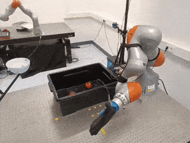

# TamedPUMA: safe and stable imitation learning with geometric fabrics 

Code accompanying the paper "TamedPUMA: safe and stable imitation learning with geometric fabrics" (L4DC 2025) :tiger:. 
The paper is available at [Arxiv](https://arxiv.org/abs/2503.17432v1), and our [website](https://autonomousrobots.nl/paper_websites/pumafabrics) contains several videos and background material. 

TamedPUMA is a safe and stable extension of learned stable motion primitives (PUMA) augmented with the recently developed
geometric fabrics for safe and stable operations in the presence of obstacles.
Examples include a KUKA iiwa manipulator performing a tomato-picking task and pouring task, and illustrative point-robot examples. 
The examples with a gen3-lite kinova and kinova with Clearpath base are under construction.

If there are questions or issues, please open a Github Issue and we will be in touch!

## Teaser
For more videos and details, check out our [website](https://autonomousrobots.nl/paper_websites/pumafabrics), and the [Appendix](/assets/TamedPUMA_appendix.pdf)



## Installation:
### Install via poetry
```bash
poetry install
poetry update
```

### Install via pip:
```bash
pip install -r requirements.txt
```

### Cuda version issues
If you have issues with torch's CUDA version, e.g the cuda version is incompatible wtth your GPU, uninstall torch and install the correct version, for example for CUDA 11.8:
```bash
# tested with cuda 11.8
pip uninstall torch torchvision
pip install torch torchvision --extra-index-url https://download.pytorch.org/whl/cu118
```

## Steps to run an example
### Training a DNN
To run any example, an appropriate DNN should be trained. 

For example, for  examples/point_robot_PUMA.py, you need to train a network a second order 2D network, i.e. 2nd_order_2D.
Train a network via [train.py](pumafabrics/puma_adapted/train.py).
Indicate the correct parameter-file found in the folder [params](pumafabrics/puma_adapted/params) by replacing the default argument (or give an argument) to be: 2nd_order_2D:
 ```bash
parser.add_argument('--params', type=str, default='2nd_order_2D', help='')
 ```
The training time depends on the "max_iterations" in the [parameter file](pumafabrics/puma_adapted/params/2nd_order_2D.py), you can lower this parameter to reduce training time.
Default parameters result in training between 20 min and 2h depending on the network complexity and your PC. 

### Running an example
Execute one of the example scripts from within the [examples](examples)-folder. For a point-mass example of TamedPUMA:
```bash
point_robot_TamedPUMA_CPM.py
```

For a KUKA iiwa 14 example:
```bash
kuka_TamedPUMA.py
```

If you want to run the evaluation to create the results in the paper, check out [evaluations](evaluations). 
Be aware that we are continuing to work on this repository, for the original results of the paper, check the branch "L4DC2025".

## Citation
Like this work, please cite our paper via:
```bibtex
@article{bakker2025tamedpuma,
  title={TamedPUMA: safe and stable imitation learning with geometric fabrics},
  author={Bakker, Saray and P{\'e}rez-Dattari, Rodrigo and Della Santina, Cosimo and B{\"o}hmer, Wendelin and Alonso-Mora, Javier},
  journal={arXiv preprint arXiv:2503.17432},
  year={2025}
}
```


